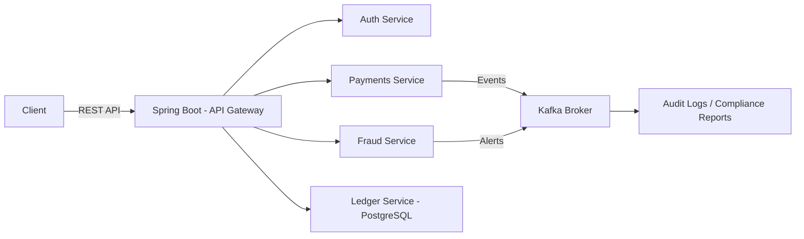

# 🏦 Amurix: Modern Banking Backend  

Amurix is a **banking backend platform** built with **Java Spring Boot**, designed to showcase **enterprise-grade practices** for account management, secure authentication, resilient transaction processing, and risk/fraud checks.  

This project highlights **skills and architecture patterns used in banks and financial services**, including **event-driven microservices with Kafka, resilient design, and audit-compliant logging**.  

---

## ✨ Features  

### 🔐 Authentication & Security  
- OAuth2 with JWT (access + refresh tokens)  
- Role-Based Access Control (customer, admin, compliance officer)  
- Secure password hashing and token lifecycle management  
- Circuit breakers and retries for resilient service calls (Resilience4j)  

### 💳 Core Banking Operations  
- User registration and account management  
- Balance tracking with **double-entry ledger logic**  
- Real-time transaction processing (credits/debits)  
- End-of-day reconciliation batch job  
- Transaction history with filters (date, type, amount range)  

### 📊 Risk & Compliance  
- Pre-transaction validation (funds check, account status, exposure limits)  
- Simple fraud detection rules (e.g., high-value transaction flags, rapid transaction alerts)  
- Transaction audit logs with immutable records  
- Compliance-ready reports (daily summaries, suspicious activity logs)  

### 🔄 Event-Driven Architecture  
- **Apache Kafka** integration for:  
  - Transaction event streaming  
  - Fraud alerts  
  - Asynchronous audit logging  

### ☁️ Deployment & DevOps  
- Packaged with Docker for containerized microservices  
- CI/CD pipelines using GitHub Actions + Maven  
- Deployable to **AWS ECS** with PostgreSQL (RDS) backend  
- Monitoring with Prometheus + Grafana (basic metrics)  

---

## 🏗 Architecture Overview  


## 🛠 Tech Stack  

- **Language:** Java 17  
- **Framework:** Spring Boot 3.x (Spring Security, Spring Data JPA)  
- **Database:** PostgreSQL (ledger, accounts, audit logs)  
- **Messaging:** Apache Kafka  
- **Security:** OAuth2, JWT, RBAC, Resilience4j  
- **DevOps:** Maven, Docker, GitHub Actions  
- **Deployment:** AWS ECS + RDS  
- **Monitoring:** Prometheus, Grafana  

---

## 🚀 Getting Started  

### Prerequisites  
- Java 17  
- Maven 3.9+  
- Docker & Docker Compose  
- PostgreSQL 14+  
- Kafka (local or cloud instance)  

### Setup Instructions  

1. **Clone the repository**
   
   ```bash
   git clone https://github.com/your-username/amurix.git
   cd amurix
3. **Build the project**
   
   ```bash
   mvn clean install
5. **Run services with Docker Compose**
   ```bash
   docker-compose up -d
6. **Access Services**
   * API Gateway: http://localhost:8080
   * Swagger Docs: http://localhost:8080/swagger-ui.html
   * Kafka UI (if enabled): http://localhost:9000
  
   
   


    
